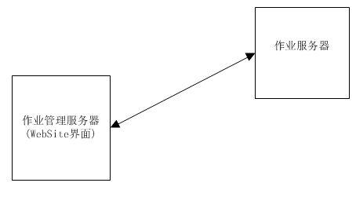
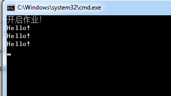
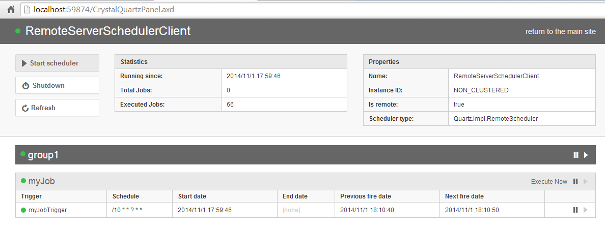

# Net作业调度(二) -CrystalQuartz远程管理
## 介绍  
上篇已经了解Quartz.NET的基本使用方法了。但如果想方便的知道某个作业执行情况，需要暂停，启动等操作行为，这时候就需要个Job管理的界面。  

本文介绍Quartz.NET如何进行远程job管理，如图:  
  
## 实战  
一：作业服务端  
```
static void Main(string[] args)
       {
           var properties = new NameValueCollection();
           properties["quartz.scheduler.instanceName"] = "RemoteServerSchedulerClient";
 
           // 设置线程池
           properties["quartz.threadPool.type"] = "Quartz.Simpl.SimpleThreadPool, Quartz";
           properties["quartz.threadPool.threadCount"] = "5";
           properties["quartz.threadPool.threadPriority"] = "Normal";
 
           // 远程输出配置
           properties["quartz.scheduler.exporter.type"] = "Quartz.Simpl.RemotingSchedulerExporter, Quartz";
           properties["quartz.scheduler.exporter.port"] = "556";
           properties["quartz.scheduler.exporter.bindName"] = "QuartzScheduler";
           properties["quartz.scheduler.exporter.channelType"] = "tcp";
 
           var schedulerFactory = new StdSchedulerFactory(properties);
           var scheduler = schedulerFactory.GetScheduler();
 
           var job = JobBuilder.Create<PrintMessageJob>()
               .WithIdentity("myJob", "group1")
               .Build();
 
           var trigger = TriggerBuilder.Create()
               .WithIdentity("myJobTrigger", "group1")
               .StartNow()
               .WithCronSchedule("/10 * * ? * *")
               .Build();
           scheduler.ScheduleJob(job, trigger);
           scheduler.Start();
 
       }


public class PrintMessageJob : IJob
   {
       public void Execute(IJobExecutionContext context)
       {
           Console.WriteLine("Hello!");
       }
   }
```
启动如下  
  
二：作业远程管理端，无需写任何代码，引用官方程序集，嵌入到已有的web网站。   

      PM> Install-Package CrystalQuartz.Remote  

      Webconfig 需要配置的地方  
	  
```
<configuration> 
    <crystalQuartz>
        <provider>
            <add property="Type" value="CrystalQuartz.Core.SchedulerProviders.RemoteSchedulerProvider, CrystalQuartz.Core" />
            <add property="SchedulerHost" value="tcp://127.0.0.1:556/QuartzScheduler" /> <!--TCP监听的地址-->
        </provider>
 
    </crystalQuartz>
<system.webServer>
      <!-- Handler拦截处理了，输出作业监控页面-->
        <handlers>
            <add name="CrystalQuartzPanel" verb="*" path="CrystalQuartzPanel.axd" type="CrystalQuartz.Web.PagesHandler, CrystalQuartz.Web" />
        </handlers>
    </system.webServer>
</configuration>
```

　Web管理界面  
   
 ## 其他  
 CrystalQuartz 提供基础功能，可以继续在此基础上进行二次开发，另外推荐使用Window服务寄宿，比较方法。

参考资源

张善友   　　　　　　　　    http://www.cnblogs.com/shanyou/archive/2012/01/15/2323011.html  

CrystalQuartz开源的地址 　　https://github.com/guryanovev/CrystalQuartz  

出处： http://www.cnblogs.com/mushroom/p/4067558.html  