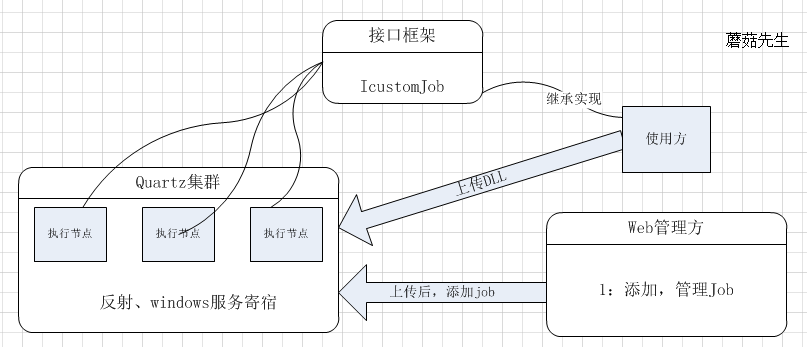
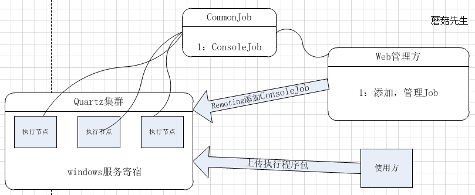
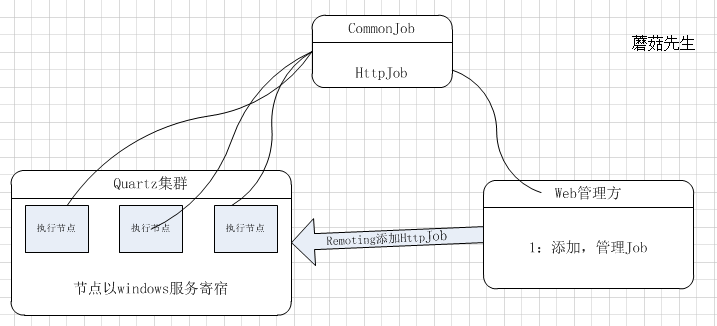
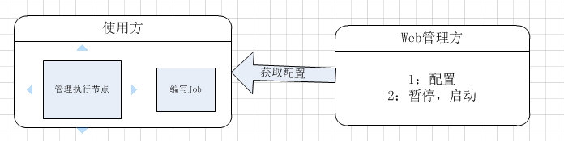

# Net作业调度(五)—quartz.net动态添加job设计  

## 介绍  
在实际项目使用中quartz.net中，都希望有一个管理界面可以动态添加job，而避免每次都要上线发布。   

也看到有园子的同学问过。这里就介绍下实现动态添加job的几种方式， 也是二次开发的核心模块。  
## 传统方式  
 继承IJob，实现业务逻辑，添加到scheduler。  
 ```
 public class MonitorJob : IJob
    {
        public void Execute(IJobExecutionContext context)
        {
            //do something
            Console.WriteLine("test");
        }
    }
 //var job = JobBuilder.Create<MonitorJob>()
            //    .WithIdentity("test", "value")
            //    .Build();
            //var trigger = (ICronTrigger) TriggerBuilder.Create()
            //    .WithIdentity("test", "value")
            //    .WithCronSchedule("0 0/5 * * * ?")
            //    .Build();
            //scheduler.ScheduleJob(job, trigger);
 ```
 
 也可以使用CrystalQuartz远程管理暂停取消。之前的博客CrystalQuartz远程管理(二)。  
##  框架反射方式   
这种方式需要定义一套接口框架。 比如：  
```
interface IcustomJob
    {
        void Excute(string context);
        void Failed(string error);
        void Complete(string msg);
    }
```
1：当我们写job时同一实现这个框架接口，类库形式。  

2：写完后编译成DLL，上传到我们的作业执行节点。  

3：在执行节点中，通过反射拿到DLL的job信息。  

4：然后构建quartz的job，添加到scheduler。  

这种方式缺点： 耦合性太高，开发量较大。 优点：集中式管理。  

系统结构如图：  
  

### 进程方式  
这个方式和windows任务计划类似。  

1：使用方编写自己的job，无需实现任何接口，可执行应用程序形式。  

2：将程序发送到执行节点，由执行节点起进程调用job程序。  

执行节点调用，示例如下：  

```
public class ConsoleJob:IJob
    {
        public void Execute(IJobExecutionContext context)
        {
            JobDataMap dataMap = context.JobDetail.JobDataMap;
            string content = dataMap.GetString("jobData");
            var jd = new JavaScriptSerializer().Deserialize<ConsoleJobData>(content);

            Process p = new Process();
            p.StartInfo.UseShellExecute = true;
            p.StartInfo.FileName = jd.Path;
            p.StartInfo.Arguments = jd.Parameters;   //空格分割
            p.StartInfo.WindowStyle = ProcessWindowStyle.Minimized;
            p.Start();
        }
    }
```
这种方式相对来说： 耦合性中等，执行节点和job相互不关心，没有依赖，开发量较小。  

系统结构如图：  
  
## URL方式  
URL方式和第三种类似，不过调用的不在是执行程序，而是URL。  

1： 使用方在网页或服务中，实现业务逻辑。  

2： 然后将Url，交给执行节点post或get执行。  

执行节点调用，示例如下：  
```
public class HttpJob : IJob
    {
        public void Execute(IJobExecutionContext context)
        {
            var dataMap = context.JobDetail.JobDataMap;

            var content = dataMap.GetString("jobData");

            var jd = new JavaScriptSerializer().Deserialize<HttpJobData>(content);

            if (jd.Parameters == null)
                jd.Parameters = string.Empty;
            if (jd.Timeout == 0)
                jd.Timeout = 5*60;

            var result = RequestHelper.Post(jd.Url, jd.ContentType, jd.Timeout, jd.Parameters, jd.heads);
        }
    }
```

这种方式耦合比较低，使用方不需要单独写应用程序了，和平常业务开发一样。  

执行节点的职权，仅仅作为一个触发器。  

有2点需要注意的是：  

1：请求URL时，注意双方约定token加密，防止非执行节点执行调用。  

2：使用方，如果有耗时操作，建议异步执行。   

系统结构如图：  
 

## 框架配置方式  
1：使用方直接使用quartz.net框架，实现自己的job。从管理方拉取执行节点配置，然后自行管理执行节点。  

2：使用方也可以暴露端口给管理方，以实现监控，修改配置。  

这种形式，耦合性最低。是把管理方当成一个配置中心。     ps：几乎和传统方式+CrystalQuartz一样了。  

  

通过context.JobDetail.JobDataMap，可以保存job的需要的信息。  

本篇介绍主流的几种实现方案，供大家参考使用。  

转载： http://www.cnblogs.com/mushroom/p/4231834.html  
