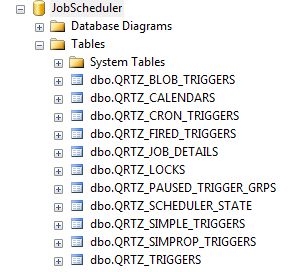
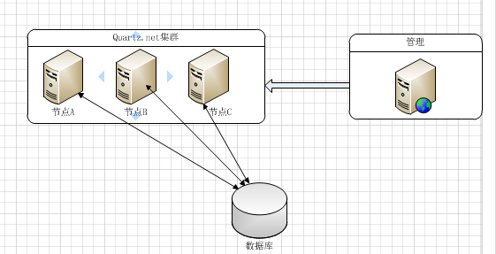
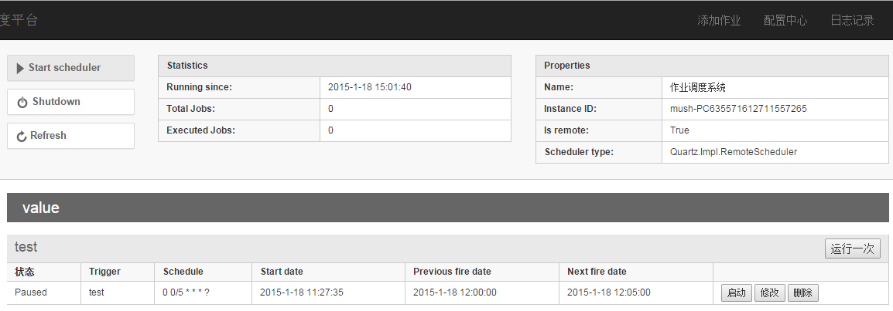

# Net作业调度(四)—quartz.net持久化和集群  
介绍  
在实际使用quartz.net中，持久化能保证实例重启后job不丢失、 集群能均衡服务器压力和解决单点问题。  

quartz.net在这两方面配置都比较简单。  

### 持久化  
quartz.net的持久化，是把job、trigger一些信息存储到数据库里面，以解决内存存储重启丢失。  

下载sql脚本  

           https://github.com/quartznet/quartznet/blob/master/database/tables/tables_sqlServer.sql  

创建个数据库，并执行脚本  
  

  QRTZ_BLOB_TRIGGERS  以Blob 类型存储的触发器。  

  QRTZ_CALENDARS   存放日历信息， quartz.net可以指定一个日历时间范围。  

  QRTZ_CRON_TRIGGERS  cron表达式触发器。  

  QRTZ_JOB_DETAILS      job详细信息。  

  QRTZ_LOCKS       集群实现同步机制的行锁表  

  QRTZ_SCHEDULER_STATE   实例信息，集群下多使用。  

###  quartz.net 配置  
```
//===持久化====
            //存储类型
            properties["quartz.jobStore.type"] = "Quartz.Impl.AdoJobStore.JobStoreTX, Quartz";
            //表明前缀
            properties["quartz.jobStore.tablePrefix"] = "QRTZ_";
            //驱动类型
            properties["quartz.jobStore.driverDelegateType"] = "Quartz.Impl.AdoJobStore.SqlServerDelegate, Quartz";
            //数据源名称
            properties["quartz.jobStore.dataSource"] = "myDS";
            //连接字符串
            properties["quartz.dataSource.myDS.connectionString"] = @"Data Source=(local);Initial Catalog=JobScheduler;User ID=sa;Password=123465";
            //sqlserver版本
            properties["quartz.dataSource.myDS.provider"] = "SqlServer-20";
```
### 启动客户端  
```
var properties = JobsManager.GetProperties();
            var schedulerFactory = new StdSchedulerFactory(properties);
            scheduler = schedulerFactory.GetScheduler();
            scheduler.Start();

            //var job = JobBuilder.Create<MonitorJob>()
            //    .WithIdentity("test", "value")
            //    .Build();

            //var trigger = (ICronTrigger) TriggerBuilder.Create()
            //    .WithIdentity("test", "value")
            //    .WithCronSchedule("0 0/5 * * * ?")
            //    .Build();
            //scheduler.ScheduleJob(job, trigger);
```

补充  
   1： 持久化后，job只有添加一次了(数据库已经有了)，所以不能再执行端写添加job的行为。这时候需要一个管理工具，动态添加操作。  

     2： quartz.net 支持sql server、sqlite、mysql、oracle、mongodb(非官方版)。  
	 
### 集群  
部署图：  
  

如图quartz.net 的集群模式是依赖数据库表的，所以要持久化配置。  集群节点之间是不通信的，这样分布式的架构，很方便进行水平扩展。  

1: 除了线程池数量，instanceId可以不同外，各个节点的配置必须是一样的。  

2：集群中节点的系统时间一致。    

3：多线程、集群中。quartz.net 利用数据库锁来保证job不会重复执行。  

     源码在DBSemaphore.cs、UpdateLockRowSemaphore.cs、StdRowLockSemaphore.cs  

4：集群化后，某节点失效后，剩余的节点能保证job继续执行下去。  

实例配置后启动。  

```
   //cluster
            properties["quartz.jobStore.clustered"] = "true";
            properties["quartz.scheduler.instanceId"] = "AUTO";
```
简单管理界面：  


摘自：http://www.cnblogs.com/mushroom/p/4231642.html#3670385  