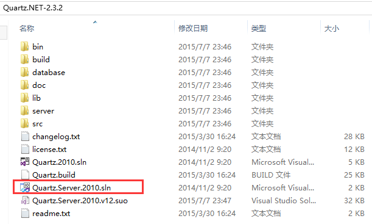
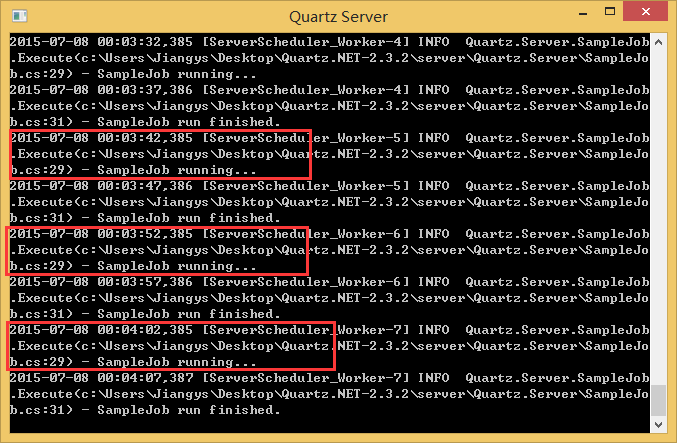
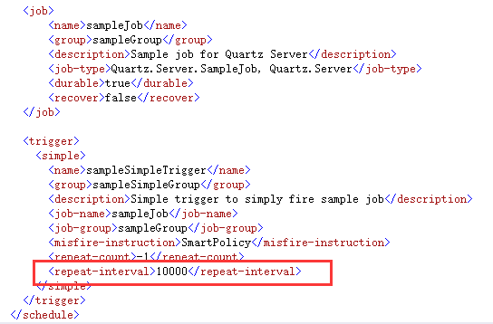
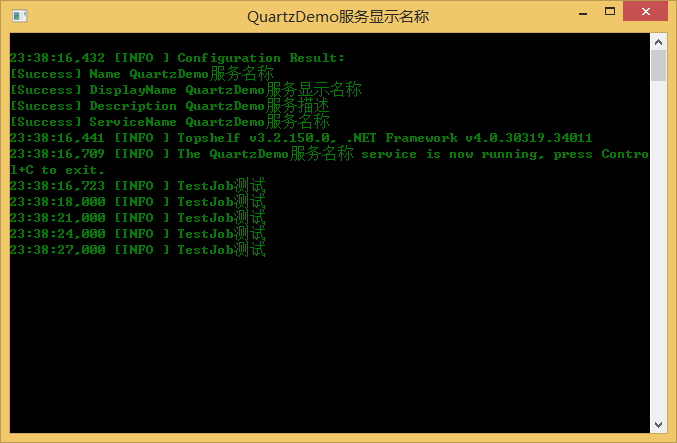

# Quartz.NetDemo
## Quartz.NET 入门
### 概述
Quartz.NET是一个开源的作业调度框架，非常适合在平时的工作中，定时轮询数据库同步，定时邮件通知，定时处理数据等。 Quartz.NET允许开发人员根据时间间隔（或天）来调度作业。它实现了作业和触发器的多对多关系，还能把多个作业与不同的触发器关联。整合了 Quartz.NET的应用程序可以重用来自不同事件的作业，还可以为一个事件组合多个作业。
### 参考
官方学习文档：http://www.quartz-scheduler.net/documentation/index.html

使用实例介绍：http://www.quartz-scheduler.net/documentation/quartz-2.x/quick-start.html

官方的源代码下载：http://sourceforge.net/projects/quartznet/files/quartznet/   或者到我上传的csdn下载：http://download.csdn.net/detail/jys1216/8878305

下载下来官方的例子，我们来分析一下：
解压后，看到的文档

打开后，看到的项目结构如下：

项目可以直接运行：

运行后，我们可以看到，每隔10秒有输出，那是因为，在配置quart.net的服务文件里，配置了每10秒执行一次

## 快速搭建一个Quartz
### 第一步：安装
新建一个QuartzDemo项目后,安装下面的程序包

Install-Package Quartz
Install-Package Common.Logging.Log4Net1211
Install-Package log4net
Install-Package Topshelf
Install-Package Topshelf.Log4Net
 Quartz依赖Common.Logging和Common.Logging.Log4Net1211，又因为Log4Net是比较标准的日志工具，因此我们一般都会安装log4net，另外定时作业一般都允许在后台服务中，因此我们也安装了Topshelf。
 ### 第二步：实现IJob
 TestJob.cs 实现IJob，在Execute方法里编写要处理的业务逻辑，系统就会按照Quartz的配置，定时处理。
 ```
 using log4net;
using Quartz;
using System;
using System.Collections.Generic;
using System.Linq;
using System.Text;
using System.Threading.Tasks;

namespace QuartzDemo.QuartzJobs
{
    public sealed class TestJob : IJob
    {
        private readonly ILog _logger = LogManager.GetLogger(typeof(TestJob));

        public void Execute(IJobExecutionContext context)
        {
            _logger.InfoFormat("TestJob测试");
        }
    }
}
 ```
 
 ### 第三步：使用Topshelf调度任务
 Topshelf的使用介绍,请看我的另一遍介绍：http://www.cnblogs.com/jys509/p/4614975.html

ServiceRunner.cs
```
using Quartz;
using Quartz.Impl;
using System;
using System.Collections.Generic;
using System.Linq;
using System.Text;
using System.Threading.Tasks;
using Topshelf;

namespace QuartzDemo
{
    public sealed class ServiceRunner : ServiceControl, ServiceSuspend
    {
        private readonly IScheduler scheduler;

        public ServiceRunner()
        {
            scheduler = StdSchedulerFactory.GetDefaultScheduler();
        }

        public bool Start(HostControl hostControl)
        {
            scheduler.Start();
            return true;
        }

        public bool Stop(HostControl hostControl)
        {
            scheduler.Shutdown(false);
            return true;
        }

        public bool Continue(HostControl hostControl)
        {
            scheduler.ResumeAll();
            return true;
        }

        public bool Pause(HostControl hostControl)
        {
            scheduler.PauseAll();
            return true;
        }


    }
}
```
### 第四步：程序入口
```
namespace QuartzDemo
{
    class Program
    {
        static void Main(string[] args)
        {
            log4net.Config.XmlConfigurator.ConfigureAndWatch(new FileInfo(AppDomain.CurrentDomain.BaseDirectory + "log4net.config"));
            HostFactory.Run(x =>
            {
                x.UseLog4Net();

                x.Service<ServiceRunner>();

                x.SetDescription("QuartzDemo服务描述");
                x.SetDisplayName("QuartzDemo服务显示名称");
                x.SetServiceName("QuartzDemo服务名称");

                x.EnablePauseAndContinue();
            });
        }
    }
}
```
### 第五步：配置quartz.config、quartz_jobs.xml、log4net.config
说明：这三个文件，分别选中→右键属性→复制到输入目录设为：始终复制

#### quartz.config
```
# You can configure your scheduler in either <quartz> configuration section
# or in quartz properties file
# Configuration section has precedence

quartz.scheduler.instanceName = QuartzTest

# configure thread pool info
quartz.threadPool.type = Quartz.Simpl.SimpleThreadPool, Quartz
quartz.threadPool.threadCount = 10
quartz.threadPool.threadPriority = Normal

# job initialization plugin handles our xml reading, without it defaults are used
quartz.plugin.xml.type = Quartz.Plugin.Xml.XMLSchedulingDataProcessorPlugin, Quartz
quartz.plugin.xml.fileNames = ~/quartz_jobs.xml

# export this server to remoting context
#quartz.scheduler.exporter.type = Quartz.Simpl.RemotingSchedulerExporter, Quartz
#quartz.scheduler.exporter.port = 555
#quartz.scheduler.exporter.bindName = QuartzScheduler
#quartz.scheduler.exporter.channelType = tcp
#quartz.scheduler.exporter.channelName = httpQuartz
```
#### quartz_jobs.xml
```
<?xml version="1.0" encoding="UTF-8"?>

<!-- This file contains job definitions in schema version 2.0 format -->

<job-scheduling-data xmlns="http://quartznet.sourceforge.net/JobSchedulingData" xmlns:xsi="http://www.w3.org/2001/XMLSchema-instance" version="2.0">

  <processing-directives>
    <overwrite-existing-data>true</overwrite-existing-data>
  </processing-directives>

  <schedule>
    
    <!--TestJob测试 任务配置-->
    <job>
      <name>TestJob</name>
      <group>Test</group>
      <description>TestJob测试</description>
      <job-type>QuartzDemo.QuartzJobs.TestJob,QuartzDemo</job-type>
      <durable>true</durable>
      <recover>false</recover>
    </job>
    <trigger>
      <cron>
        <name>TestJobTrigger</name>
        <group>Test</group>
        <job-name>TestJob</job-name>
        <job-group>Test</job-group>
        <start-time>2015-01-22T00:00:00+08:00</start-time>
        <cron-expression>0/3 * * * * ?</cron-expression>
      </cron>
    </trigger>
    
  </schedule>
</job-scheduling-data>
```
#### log4net.config
```
<?xml version="1.0" encoding="utf-8" ?>
<configuration>
  <configSections>
    <section name="log4net" type="log4net.Config.Log4NetConfigurationSectionHandler, log4net"/>
  </configSections>

  <log4net>
    <appender name="RollingLogFileAppender" type="log4net.Appender.RollingFileAppender">
      <!--日志路径-->
      <param name= "File" value= "D:\App_Log\servicelog\"/>
      <!--是否是向文件中追加日志-->
      <param name= "AppendToFile" value= "true"/>
      <!--log保留天数-->
      <param name= "MaxSizeRollBackups" value= "10"/>
      <!--日志文件名是否是固定不变的-->
      <param name= "StaticLogFileName" value= "false"/>
      <!--日志文件名格式为:2008-08-31.log-->
      <param name= "DatePattern" value= "yyyy-MM-dd&quot;.read.log&quot;"/>
      <!--日志根据日期滚动-->
      <param name= "RollingStyle" value= "Date"/>
      <layout type="log4net.Layout.PatternLayout">
        <param name="ConversionPattern" value="%d [%t] %-5p %c - %m%n %loggername" />
      </layout>
    </appender>

    <!-- 控制台前台显示日志 -->
    <appender name="ColoredConsoleAppender" type="log4net.Appender.ColoredConsoleAppender">
      <mapping>
        <level value="ERROR" />
        <foreColor value="Red, HighIntensity" />
      </mapping>
      <mapping>
        <level value="Info" />
        <foreColor value="Green" />
      </mapping>
      <layout type="log4net.Layout.PatternLayout">
        <conversionPattern value="%n%date{HH:mm:ss,fff} [%-5level] %m" />
      </layout>

      <filter type="log4net.Filter.LevelRangeFilter">
        <param name="LevelMin" value="Info" />
        <param name="LevelMax" value="Fatal" />
      </filter>
    </appender>

    <root>
      <!--(高) OFF > FATAL > ERROR > WARN > INFO > DEBUG > ALL (低) -->
      <level value="all" />
      <appender-ref ref="ColoredConsoleAppender"/>
      <appender-ref ref="RollingLogFileAppender"/>
    </root>
  </log4net>
</configuration>
```

运行后，效果下图，每隔3秒有输出

最后，就是安装成windows服务了。具体安装参考：http://www.cnblogs.com/jys509/p/4614975.html

源码下载：http://download.csdn.net/download/jys1216/8882315

## Quartz配置
#### quartz_jobs.xml
##### job 任务

其实就是1.x版本中的<job-detail>，这个节点是用来定义每个具体的任务的，多个任务请创建多个job节点即可

name(必填) 任务名称，同一个group中多个job的name不能相同，若未设置group则所有未设置group的job为同一个分组，如:<name>sampleJob</name>
group(选填) 任务所属分组，用于标识任务所属分组，如:<group>sampleGroup</group>
description(选填) 任务描述，用于描述任务具体内容，如:<description>Sample job for Quartz Server</description>
job-type(必填) 任务类型，任务的具体类型及所属程序集，格式：实现了IJob接口的包含完整命名空间的类名,程序集名称，如:<job-type>Quartz.Server.SampleJob, Quartz.Server</job-type>
durable(选填) 具体作用不知，官方示例中默认为true，如:<durable>true</durable>
recover(选填) 具体作用不知，官方示例中默认为false，如:<recover>false</recover>
#### trigger 任务触发器

用于定义使用何种方式出发任务(job)，同一个job可以定义多个trigger ，多个trigger 各自独立的执行调度，每个trigger 中必须且只能定义一种触发器类型(calendar-interval、simple、cron)

calendar-interval 一种触发器类型，使用较少，此处略过

simple 简单任务的触发器，可以调度用于重复执行的任务

name(必填) 触发器名称，同一个分组中的名称必须不同
group(选填) 触发器组
description(选填) 触发器描述
job-name(必填) 要调度的任务名称，该job-name必须和对应job节点中的name完全相同
job-group(选填) 调度任务(job)所属分组，该值必须和job中的group完全相同
start-time(选填) 任务开始执行时间utc时间，北京时间需要+08:00，如：<start-time>2012-04-01T08:00:00+08:00</start-time>表示北京时间2012年4月1日上午8:00开始执行，注意服务启动或重启时都会检测此属性，若没有设置此属性或者start-time设置的时间比当前时间较早，则服务启动后会立即执行一次调度，若设置的时间比当前时间晚，服务会等到设置时间相同后才会第一次执行任务，一般若无特殊需要请不要设置此属性
repeat-count(必填)  任务执行次数，如:<repeat-count>-1</repeat-count>表示无限次执行，<repeat-count>10</repeat-count>表示执行10次
repeat-interval(必填) 任务触发间隔(毫秒)，如:<repeat-interval>10000</repeat-interval> 每10秒执行一次
cron复杂任务触发器--使用cron表达式定制任务调度（强烈推荐)

name(必填) 触发器名称，同一个分组中的名称必须不同
group(选填) 触发器组d
escription(选填) 触发器描述
job-name(必填) 要调度的任务名称，该job-name必须和对应job节点中的name完全相同
job-group(选填) 调度任务(job)所属分组，该值必须和job中的group完全相同
start-time(选填) 任务开始执行时间utc时间，北京时间需要+08:00，如：<start-time>2012-04-01T08:00:00+08:00</start-time>表示北京时间2012年4月1日上午8:00开始执行，注意服务启动或重启时都会检测此属性，若没有设置此属性，服务会根据cron-expression的设置执行任务调度；若start-time设置的时间比当前时间较早，则服务启动后会忽略掉cron-expression设置，立即执行一次调度，之后再根据cron-expression执行任务调度；若设置的时间比当前时间晚，则服务会在到达设置时间相同后才会应用cron-expression，根据规则执行任务调度，一般若无特殊需要请不要设置此属性
cron-expression(必填) cron表达式，如:<cron-expression>0/10 * * * * ?</cron-expression>每10秒执行一次
##### Quartz的cron表达式
 官方英文介绍地址：http://www.quartz-scheduler.net/documentation/quartz-2.x/tutorial/crontrigger.html

cron expressions 整体上还是非常容易理解的，只有一点需要注意："?"号的用法，看下文可以知道“？”可以用在 day of month 和 day of week中，他主要是为了解决如下场景，如：每月的1号的每小时的31分钟，正确的表达式是：* 31 * 1 * ？，而不能是：* 31 * 1 * *，因为这样代表每周的任意一天。


由7段构成：秒 分 时 日 月 星期 年（可选）
"-" ：表示范围  MON-WED表示星期一到星期三
"," ：表示列举 MON,WEB表示星期一和星期三
"*" ：表是“每”，每月，每天，每周，每年等
"/" :表示增量：0/15（处于分钟段里面） 每15分钟，在0分以后开始，3/20 每20分钟，从3分钟以后开始
"?" :只能出现在日，星期段里面，表示不指定具体的值
"L" :只能出现在日，星期段里面，是Last的缩写，一个月的最后一天，一个星期的最后一天（星期六）
"W" :表示工作日，距离给定值最近的工作日
"#" :表示一个月的第几个星期几，例如："6#3"表示每个月的第三个星期五（1=SUN...6=FRI,7=SAT）

##### 官方实例

Expression	Meaning
0 0 12 * * ?	每天中午12点触发
0 15 10 ? * *	每天上午10:15触发
0 15 10 * * ?	每天上午10:15触发
0 15 10 * * ? *	每天上午10:15触发
0 15 10 * * ? 2005	2005年的每天上午10:15触发
0 * 14 * * ?	在每天下午2点到下午2:59期间的每1分钟触发
0 0/5 14 * * ?	在每天下午2点到下午2:55期间的每5分钟触发
0 0/5 14,18 * * ?	在每天下午2点到2:55期间和下午6点到6:55期间的每5分钟触发
0 0-5 14 * * ?	在每天下午2点到下午2:05期间的每1分钟触发
0 10,44 14 ? 3 WED	每年三月的星期三的下午2:10和2:44触发
0 15 10 ? * MON-FRI	周一至周五的上午10:15触发
0 15 10 15 * ?	每月15日上午10:15触发
0 15 10 L * ?	每月最后一日的上午10:15触发
0 15 10 L-2 * ?	Fire at 10:15am on the 2nd-to-last last day of every month
0 15 10 ? * 6L	每月的最后一个星期五上午10:15触发
0 15 10 ? * 6L	Fire at 10:15am on the last Friday of every month
0 15 10 ? * 6L 2002-2005	2002年至2005年的每月的最后一个星期五上午10:15触发
0 15 10 ? * 6#3	每月的第三个星期五上午10:15触发
0 0 12 1/5 * ?	Fire at 12pm (noon) every 5 days every month, starting on the first day of the month.
0 11 11 11 11 ?	Fire every November 11th at 11:11am.
 

## 源码下载及可能需要了解的资料
源码下载：http://download.csdn.net/download/jys1216/8882315

Topself介绍：http://www.cnblogs.com/jys509/p/4614975.html

Log4Net介绍：http://www.cnblogs.com/jys509/p/4569874.html